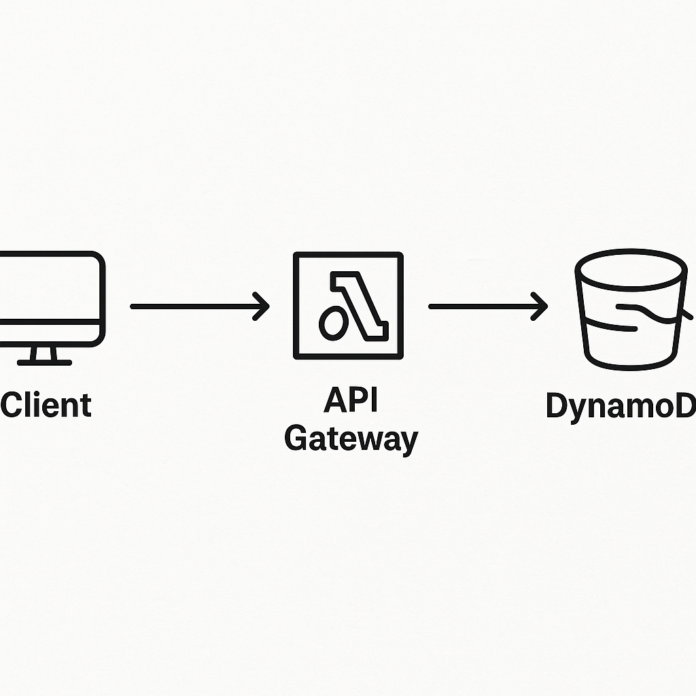

# aws-serverless-notes-api
Serverless Notes API using AWS Lambda, API Gateway, and DynamoDB




## 🏃‍♂️ How to Run the Project

### ✅ 1. Clone the Repository

```bash
git clone https://github.com/Akhil4556/aws-serverless-notes-api.git
cd aws-serverless-notes-api
```
✅ 2. Install Dependencies

```bash
npm install
```

✅ 3. Deploy to AWS
Make sure you have:

AWS CLI configured

Serverless Framework installed


Then run:

```bash
serverless deploy
```

✅ 4. Get the API URL

After deployment, Serverless will output something like:

```text
https://xxxxxxxxxx.execute-api.us-east-1.amazonaws.com/dev/notes
```

This is your API base URL ✅

✅ 5. Test the API

Example:

```bash
curl https://xxxxxxxxxx.execute-api.us-east-1.amazonaws.com/Wpdb/notes
```

